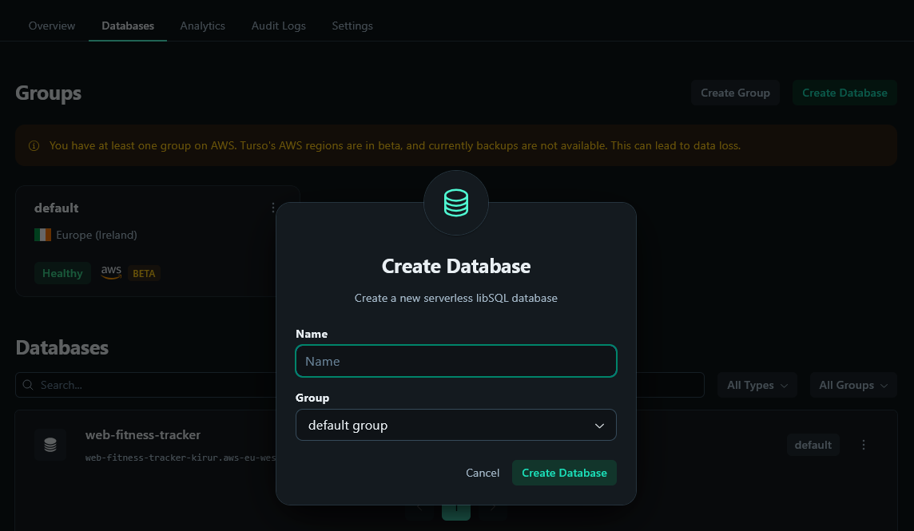
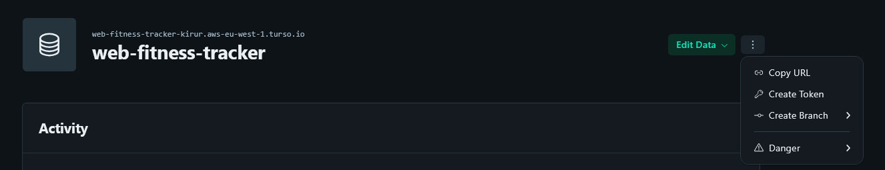
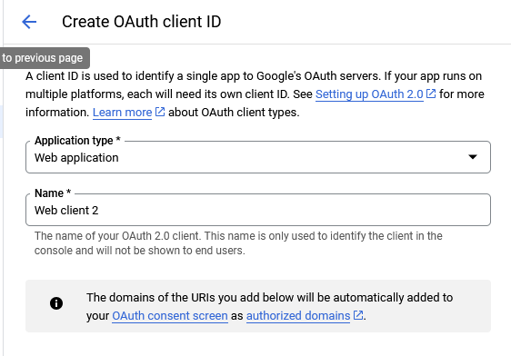
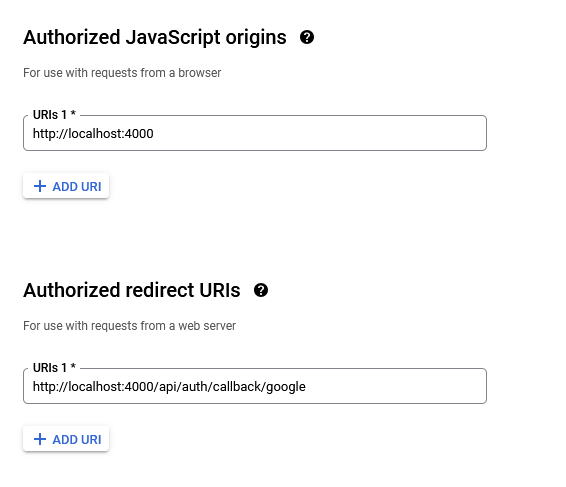
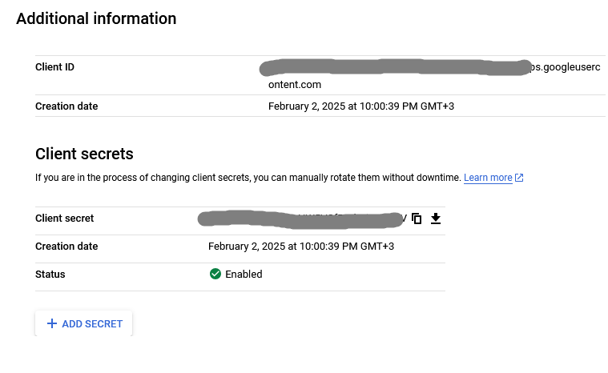
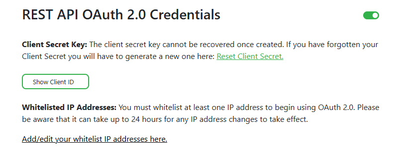

### Web Fitness Tracker
This is a [Next.js](https://nextjs.org) project bootstrapped with [`create-next-app`](https://nextjs.org/docs/app/api-reference/cli/create-next-app).

## Dependencies

You need to have node version 22 or higher

[Node js site](https://nodejs.org/)

## Installation

First, copy the repository to your local machine.

```bash
git clone git@github.com:kirurr/web-fitness-tracker.git
```

Then, run install script

```bash
npm install --legacy-peer-deps
```
`**Note:** --legacy-peer-deps is required because of the new React version`

## Getting ENV variables

In this project, we use some public APIs.

You can reference the [.env.example](./.env.example) file for the variable names.

Create a `.env.local` file in the root directory and add the following variables:

### Turso

Firstly, go to [Turso](https://turso.tech/) and create an account.

Then, create the database


After that, you can get database url and create token


Then, add the following variables to your `.env.local` file

### Google OAuth
Following the auth guide in auth.js [docs](https://authjs.dev/getting-started/authentication/oauth?framework=next-js):

You can access google dashboard by this [url](https://console.cloud.google.com/auth/clients)

You will need to create a new auth client
Select "Web application" and fill the form



Then, you will need to fill the url origins



For local environment add:

Origin: http://localhost:4000

Redirect Url: http://localhost:4000/api/auth/callback/google

`**Note:** For the auth to work on hosting provider, you need to add the url of the site to the origins`

For example:

Origin: https://web-fitness-tracker.vercel.app

Redirect url: https://web-fitness-tracker.vercel.app/api/auth/callback/google

After creating the client, grab the client ID and client secret from the client page



And add them to your `.env.local` file

### Auth Secret

For the auth to work, you need to generate Auth secret and add it to your `.env.local file`

In the local environment, you can use the following command to generate the secret

```bash
npx auth secret
```

For the deployment, you need to generate the secret and add it to the environment variable of your hosting provider

Follow the gide on auth.js [docs](https://next-auth.js.org/deployment#vercel)

### Fatsecret API

For the meals search to work, you need to create a [fatsecret](https://platform.fatsecret.com/) account


Then, you need to get your REST API OAuth 2.0 Client ID and Client Secret: [link]( https://platform.fatsecret.com/my-account/api-key)



Then, you need to add your site ip to the allowed IPs [list](https://platform.fatsecret.com/my-account/ip-restrictions)


## Starting the project
After all the configurations, you can start the project

```bash
npm run dev
```

Open [http://localhost:4000](http://localhost:4000) with your browser to see the result.

Or, you can build production ready bundle

```bash
npm run build
```
And start server

```bash
npm run start
```
