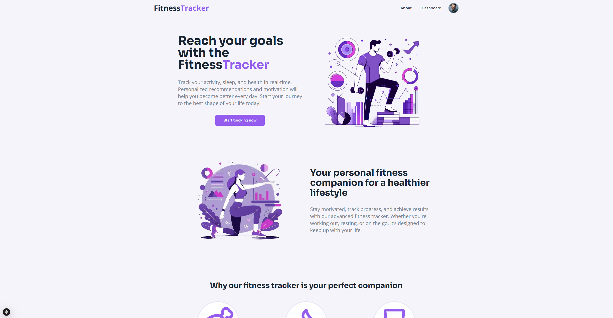
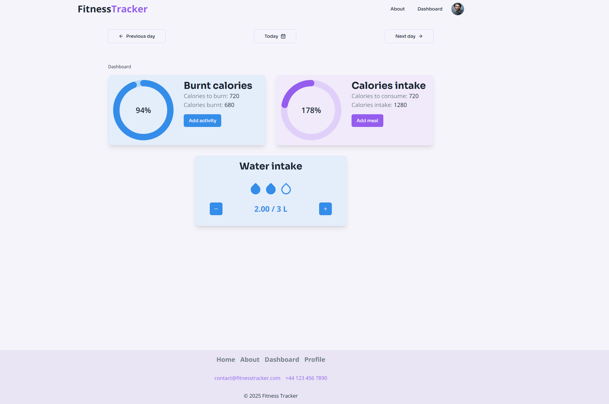
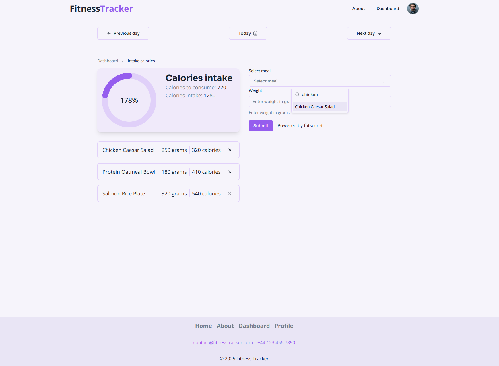

# Web Fitness Tracker

Web Fitness Tracker is a full-stack fitness dashboard for tracking calorie intake, burned calories, hydration, and personal goals in one place.

## Screenshots







## Highlights

- Personal dashboard with daily fitness overview
- Calorie intake tracking with meal logging
- Burned calories tracking with activity logging
- Water intake progress tracking
- Profile page with body metrics and nutrition goals
- Responsive UI for desktop and mobile

## Stack

- Next.js 15
- React 19
- TypeScript
- NextAuth
- Drizzle ORM
- Turso / libSQL
- Tailwind CSS
- Radix UI
- React Hook Form + Zod
- TanStack Query

## Flow

1. Open the app and create or load a profile.
2. Review daily targets on the dashboard.
3. Add meals to track calorie intake.
4. Add activities to track burned calories.
5. Update water intake and monitor progress.

## Structure

```text
src/app/         routes and layouts
src/components/  UI and feature components
src/day/         daily tracking logic
src/diet/        diet and goal logic
src/user-data/   profile and body data logic
src/fatsecret/   meal search integration
src/db/          schema and database integration
docs/images/     README assets
```

## Run

```bash
npm install --legacy-peer-deps
npm run dev
```

Open `http://localhost:4000`.

Production:

```bash
npm run build
npm run start
```
